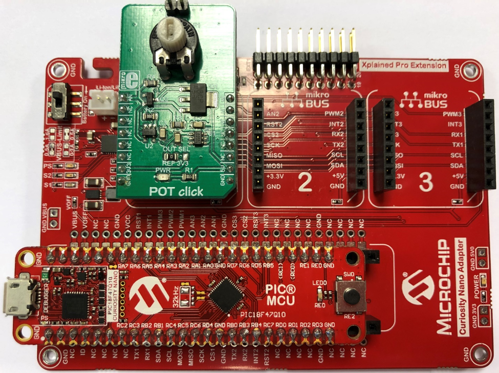

<article class="markdown-body entry-content p-3 p-md-6" itemprop="text">

# PIC18F47Q10 ADCC Single Conversion Configuration Example

The PIC18F47Q10 features one 10-bit ADCC module.
In this demo, the ADCC peripheral is used to read a value from an analog pin connected to a potentiometer. 

## Related Documentation 

- [PIC18F-Q10 Family Product Page](https://www.microchip.com/design-centers/8-bit/pic-mcus/device-selection/pic18f-q10-product-family)

## Software Used
- MPLAB® X IDE 5.30 or newer [(microchip.com/mplab/mplab-x-ide)](http://www.microchip.com/mplab/mplab-x-ide)
- MPLAB® XC8 2.10 or a newer compiler [(microchip.com/mplab/compilers)](http://www.microchip.com/mplab/compilers)
- MPLAB® Code Configurator (MCC) 3.95.0 or newer [(microchip.com/mplab/mplab-code-configurator)](https://www.microchip.com/mplab/mplab-code-configurator)
- MPLAB® Code Configurator (MCC) Device Libraries PIC10 / PIC12 / PIC16 / PIC18 MCUs [(microchip.com/mplab/mplab-code-configurator)](https://www.microchip.com/mplab/mplab-code-configurator)
- Microchip PIC18F-Q Series Device Support (1.4.109) or newer [(packs.download.microchip.com/)](https://packs.download.microchip.com/)

## Hardware Used
- PIC18F47Q10 Curiosity Nano [(DM182029)](https://www.microchip.com/Developmenttools/ProductDetails/DM182029)
- Curiosity Nano Base for Click boards™ [(AC164162)](https://www.microchip.com/Developmenttools/ProductDetails/AC164162)
- POT Click board™ [(MIKROE-3402)](https://www.mikroe.com/pot-click)

## Setup
The PIC18F47Q10 Curiosity Nano Development Board is used as test platform, along with the Curiosity Nano Base for Click boards™ and the POT Click board™.

The following configurations must be made for this project:

| Pin           | Configuration      |
| :----------: | :----------------: |
| RA0           | Analog Input       |

## Operation:
Run the code with a debugger, stop it and check the value of the variable to see the result. 

## Summary
This project showcases how the Analog-to-Digital Converter with Computation (ADCC) on the new PIC18-Q43 can be used to read an analog value from a pin.